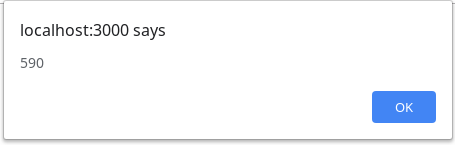

# Description

## The Blue Button

A minimal app (just a simple button) that fetches a couple of orders and calculates the total price of the filtered products... BUT there are some funny things in between, where I could learn and apply some very interesting programming concepts, including some functional stuff, like:
- function composition
- point-free style
- monads
- the publisher/subscriber pattern

## The marvelous total price output

# Start me up

1. Start the server
`npm run serve`

2. [Launch the app on your web browser](http://localhost:3000)
